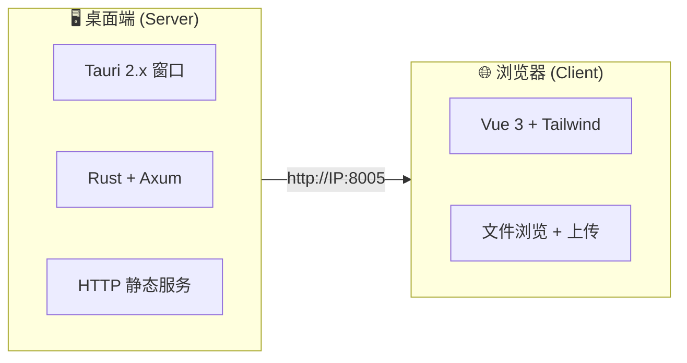
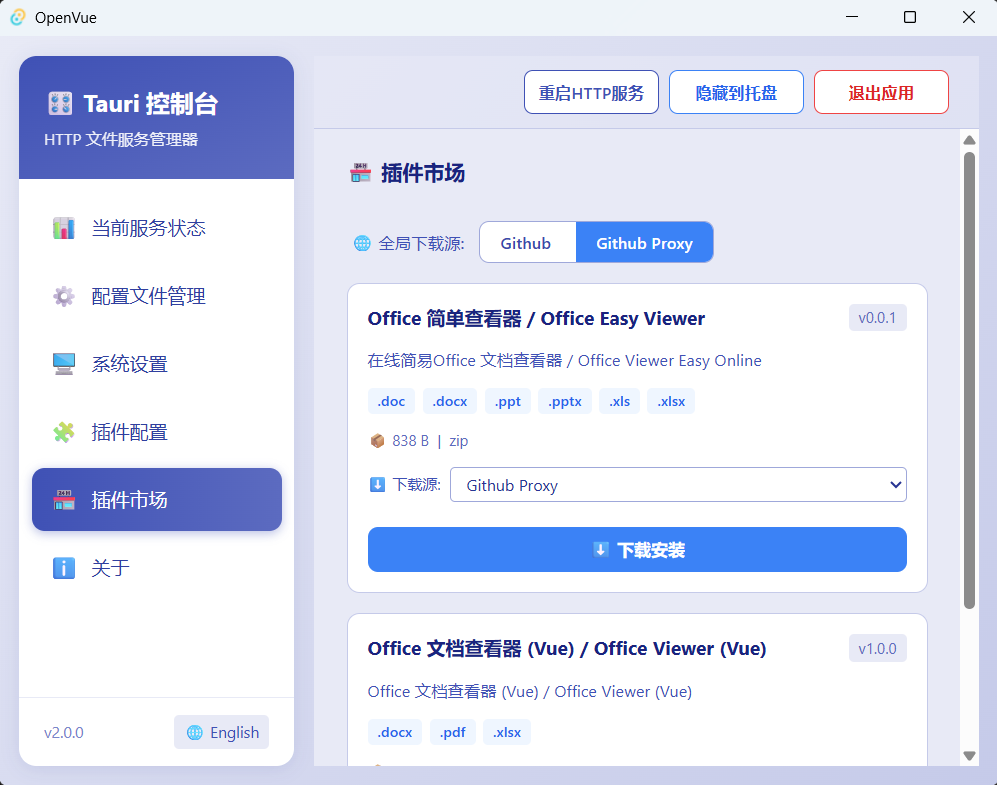

# OpenVue

🚀 **OpenVue** 是一款跨平台的本地文件共享与浏览工具，基于 **Tauri 2.x** 构建。它将 Rust 的高性能 HTTP 服务与 Vue 3 的现代化前端界面相结合，让你在局域网内快速分享文件、浏览目录，并支持插件扩展。

---

## 💡 为什么做这个项目？（和 OpenList 有什么不一样）

这个项目的初衷，是解决 OpenList（及其上游 AList）在「**文件打开方式**」上不够灵活的问题。

简单说：

- **OpenList** 里，每种文件用什么程序打开，是写死在代码里的。想支持新格式（比如 `.ggb` GeoGebra 课件），得去改前端源码、重新编译整个项目，非常麻烦。
- **OpenVue** 里，这一切是「**图形化、可配置**」的——桌面上点几下就能切换：比如 `.md` 文件，可以选「浏览器直接打开」还是「Markdown 预览插件打开」，不需要改代码，不需要重启服务。

**适合用 OpenVue 的场景**：你只是想把电脑上某个文件夹分享到局域网，让手机/平板打开特定格式（上课用的 GeoGebra 课件、Markdown 笔记等），并且希望这些格式的打开方式能随时调整。

---

## 🏗️ 项目架构



| 层级 | 技术栈 | 职责 |
|------|--------|------|
| **桌面端 (Server)** | Tauri 2.x + Rust + Axum + tower-http | 启动 HTTP 服务、托盘图标、文件服务、API 路由 |
| **客户端 (Web)** | Vue 3 + Vue Router + Vue i18n + Tailwind CSS | 文件浏览、目录导航、文件上传、插件展示 |
| **插件系统** | 插件目录内 `plugin.json` 元信息驱动 | 扩展名 → 打开方式映射，支持 GeoGebra 等第三方工具 |

---

## 🚀 执行项目

### 方法一：开发模式（源码运行）

**环境要求：**
- Node.js >= 18
- Rust 工具链（[rustup](https://rustup.rs/) ）
- Windows / macOS / Linux

```bash
# 克隆项目
git clone https://github.com/yunend/openvue.git
cd openvue

# 安装依赖
npm install

# 启动开发模式
npm run tauri dev
```

### 方法二：下载编译好的二进制文件

从 [GitHub Releases](https://github.com/yunend/openvue/releases) 下载对应操作系统的安装包：

| 操作系统 | 版本要求 | 文件格式 | 说明 |
|----------|----------|----------|------|
| Windows | Windows 10+ | `.msi` / `.exe` | 双击安装或直接运行 |
| macOS | macOS 10.15+ | `.dmg` | 拖入 Applications 文件夹 |
| Linux | Ubuntu 20.04+ / Debian 11+ | `.AppImage` / `.deb` | 添加执行权限后运行 |

---

## ⚙️ 程序配置说明

### 配置文件位置

解压或安装后，在程序目录下找到 `config.json`：


```json
{
  "port": 8005,
  "publicFolder": "public",
  "enableUpload": true
}
```

| 配置项 | 类型 | 说明 |
|--------|------|------|
| `port` | 数字 | HTTP 服务监听端口（默认 8005） |
| `publicFolder` | 字符串 | 文件根目录路径（相对或绝对路径） |
| `enableUpload` | 布尔 | 是否启用文件上传功能（上传文件保存在 `{publicFolder}/upload/` 目录下） |

### 使用步骤

1. **打开程序界面修改文件夹路径** — 在程序主界面中点击"配置文件管理"按钮，修改文件根目录（`publicFolder`）为你想要共享的文件夹路径

   

2. **修改插件配置** — 在设置界面中启用或禁用各个文件扩展名对应的插件（如 GeoGebra、MD 等），控制文件的打开方式

   

3. **浏览器访问** — 程序启动后自动打开浏览器，或手动访问 `http://localhost:8005`

   

4. **局域网内其他设备访问** — 使用 `http://<本机IP>:8005`

   

### 插件元信息 (plugin.json)

每个插件目录下包含一个 `plugin.json` 文件，描述自身信息。程序启动时自动扫描 `plugins/` 目录，聚合所有插件信息生成运行时配置。

```json
{
  "id": "ggb",
  "name": "GeoGebra",
  "version": "1.0.0",
  "description": "数学动态几何课件预览",
  "extensions": ["ggb"],
  "urlTemplate": "/plugins/{pluginId}/?path={publicPath}",
  "downloadSources": [
    { "label": "Github", "url": "https://github.com/.../plugin.zip", "priority": 1 },
    { "label": "Github Proxy", "url": "https://gh-proxy.com/.../plugin.zip", "priority": 2 }
  ],
  "sha256": "e261d6162b91991c..."
}
```

> 📌 插件市场下载的插件、自定义添加的插件，都会在其目录下生成 `plugin.json`。无需手动维护全局配置文件。
---

## 🔌 插件持续开发与集成

OpenVue 支持通过插件系统扩展文件打开方式。插件存放在 `plugins/` 目录下，每个插件目录包含 `plugin.json`（元信息）和 `index.html`（入口页面）。

### GeoGebra (GGB) 插件

已集成的 GeoGebra 插件支持在浏览器中直接打开 `.ggb` 数学课件文件。


### 插件开发

每个插件目录结构：

```
plugins/
└── <插件名>/
    └── index.html          # 插件入口页面
    └── ...                 # 插件资源文件
```

在插件目录中放置 `plugin.json` 及 `index.html`，重启应用或重新扫描即可自动注册。

### 🧩 自定义插件（图形化添加）

除了手动创建 `plugin.json`，你还可以在桌面端插件配置面板中**一键添加自定义插件**，无需改代码、无需重启：

1. **准备插件目录**：在**用户插件目录**（默认 `用户配置目录/plugins/`，可在 ⚙️ 配置管理 → 插件文件夹 设置中自定义）下新建一个子目录，放入插件文件（必须包含 `index.html`）
2. **打开插件配置面板**：启动 OpenVue 桌面应用 → 点击左侧边栏 🧩 插件配置 → 进入 🔧 自定义插件区域
3. **注册插件**：输入文件后缀名（如 `xmind`），点击 📁 浏览选择第 1 步准备好的插件目录
4. 点击 ➕ 添加插件

程序会自动在该插件目录下生成 `plugin.json`，并设置为激活状态。添加后页面立即生效，浏览器访问对应文件时自动使用你的插件打开。

> 💡 适合场景：临时想用某个第三方在线预览工具打开某类文件，只需把 HTML 页面放到 plugins 目录、在面板里点两下即可。

### 🏪 插件市场（桌面端）


插件市场提供了**一键下载安装**第三方插件的功能，无需手动配置，直接在桌面端界面操作：

1. **打开插件市场**：启动 OpenVue 桌面应用 → 点击左侧边栏 🏪 插件市场
2. **浏览可用插件**：自动从远程索引加载插件列表，展示名称、描述、版本、扩展名等信息
3. **选择下载源**：每个插件可能提供多个下载镜像（如 `Github`、`Github Proxy`），可根据网络情况自由切换
4. **下载安装**：点击 ⬇️ 下载安装，实时显示下载、校验、解压、安装各阶段进度
5. **更新与卸载**：已安装的插件若有新版本可一键更新，不再需要也可直接卸载

> 🔗 插件市场索引地址：`https://github.com/yunend/openvue-plugins`
> 欢迎提交插件，让更多人使用你的插件！

### 📦 插件开发

插件本质上是一个**标准的 Web 页面**（HTML + CSS + JS），通过 `plugin.json` 描述自身信息。OpenVue 通过 iframe 嵌入插件页面来渲染对应格式的文件。

#### 目录结构

```
plugins/
└── <插件ID>/
    ├── plugin.json          # 插件元信息（必需）
    ├── index.html           # 插件入口页面（必需）
    └── ...                  # 其他资源文件
```

#### plugin.json 规范

```json
{
  "id": "my-plugin",
  "name": "我的插件",
  "version": "1.0.0",
  "description": "插件功能描述",
  "extensions": ["ext1", "ext2"],
  "urlTemplate": "/plugins/{pluginId}/?path={publicPath}",
  "downloadSources": [
    {
      "label": "Github",
      "url": "https://github.com/user/repo/releases/download/v1.0.0/plugin.zip",
      "priority": 1
    },
    {
      "label": "Github Proxy",
      "url": "https://gh-proxy.com/https://github.com/user/repo/releases/download/v1.0.0/plugin.zip",
      "priority": 2
    }
  ],
  "sha256": "e261d6162b91991c...",
  "archiveFormat": "zip",
  "sizeBytes": 1048576
}
```

| 字段 | 说明 |
|------|------|
| `id` | 插件唯一标识，必须与目录名一致 |
| `name` | 插件显示名称 |
| `version` | 版本号，用于检测更新 |
| `extensions` | 支持的文件扩展名列表 |
| `urlTemplate` | 插件页面 URL 模板，`{pluginId}` 和 `{publicPath}` 会被自动替换 |
| `downloadSources` | 下载源数组（每个源提供相同的 ZIP 包，哈希一致），用户可自由选择 |
| `sha256` | ZIP 包的 SHA256 校验值，确保下载完整性 |
| `archiveFormat` | 打包格式（目前仅支持 `zip`） |
| `sizeBytes` | 包大小（字节），用于前端展示 |

#### 插件页面开发要点

1. **URL 参数**：插件页面通过 `?path=` 参数获取当前文件的 HTTP 访问路径
2. **文件加载**：利用 `path` 参数拼接完整 URL，通过 fetch / iframe / 等方式加载文件内容
3. **样式适配**：建议使用响应式布局，适应不同尺寸的预览区域
4. **无需后端**：插件是纯静态页面，所有逻辑在浏览器端完成

> 💡 开发完成后，将插件打包为 ZIP，连同 `plugin.json` 提交到 [openvue-plugins](https://github.com/yunend/openvue-plugins) 仓库，即可在插件市场中展示给所有用户。

### ✅ 已支持的插件

| 扩展名 | 插件名 | 说明 |
|--------|--------|------|
| `ggb` | GeoGebra | 数学动态几何课件预览 |
| `md` | Markdown | Markdown 文档预览 |
| `ppt` `pptx` | Office Viewer | PowerPoint 演示文稿预览（微软在线查看器，⚠️ 需 HTTPS 公网） |

> **⚠️ Office Viewer（需公网）**：`ppt`、`pptx` 通过 `https://view.officeapps.live.com` 微软在线查看器渲染，要求文件 URL 必须满足：
> 1. **公网可访问**：微软服务器需要能从外网拉取到你的文件，纯局域网 IP（`192.168.x.x` / `10.x.x.x`）无法使用
> 2. **HTTPS 协议**：建议使用 HTTPS（若为 HTTP 微软可能拒绝加载），请配合内网穿透或公网服务器托管使用

---

## 📧 联系方式

- **邮箱**：303218145@qq.com
- **GitHub**：[https://github.com/yunend/openvue](https://github.com/yunend/openvue)

欢迎提交 Issue、PR 或通过邮件反馈问题与建议！

---

## 📄 开源协议

本项目基于 MIT License 开源，详见 [LICENSE](LICENSE) 文件。