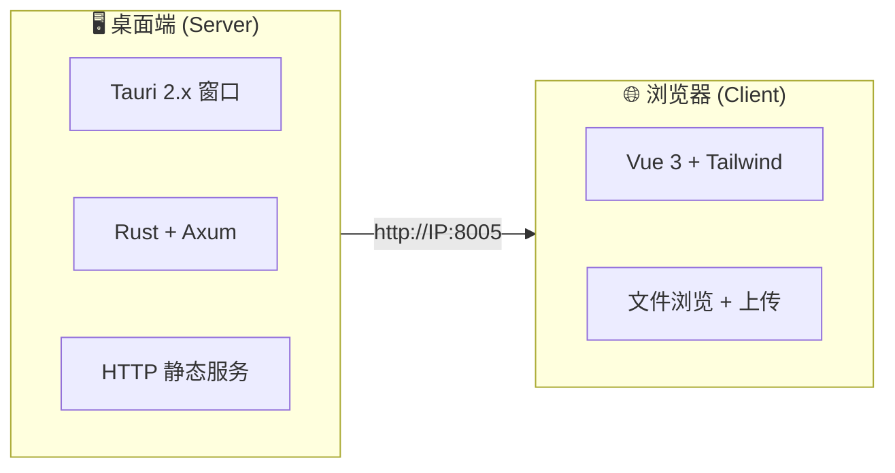
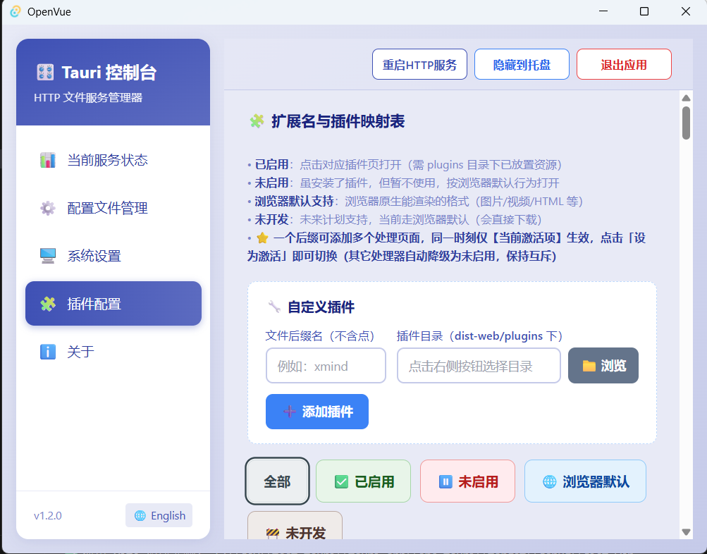
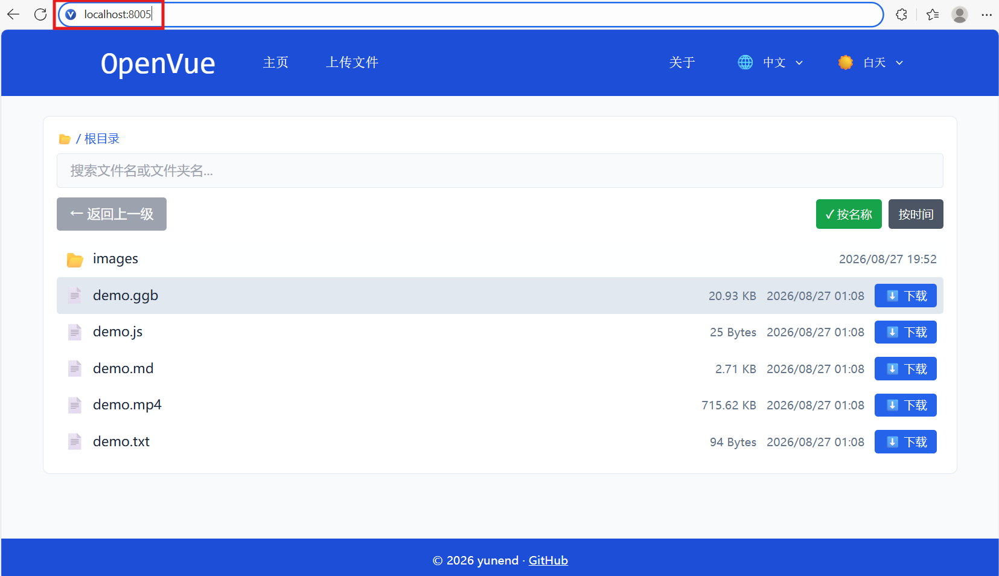
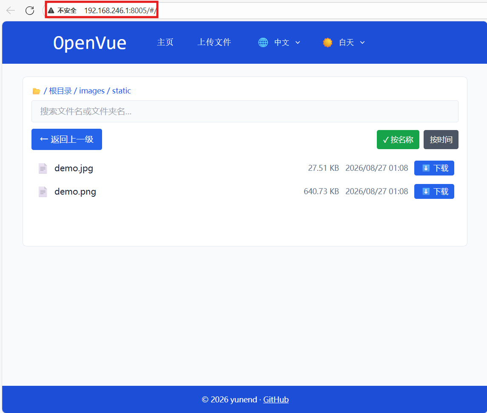
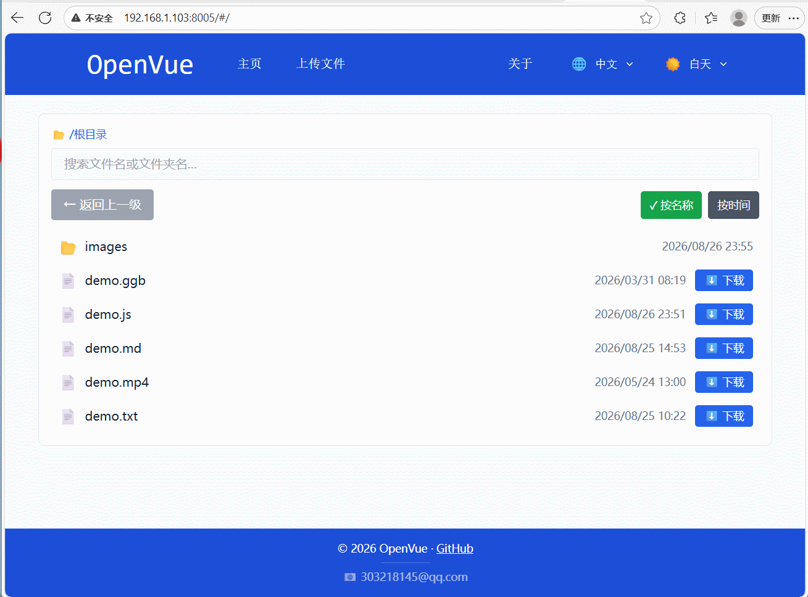

# OpenVue

🚀 **OpenVue** 是一款跨平台的本地文件共享与浏览工具，基于 **Tauri 2.x** 构建。它将 Rust 的高性能 HTTP 服务与 Vue 3 的现代化前端界面相结合，让你在局域网内快速分享文件、浏览目录，并支持插件扩展。

---

## 💡 为什么做这个项目？（和 OpenList 有什么不一样）

这个项目的初衷，是解决 OpenList（及其上游 AList）在「**文件打开方式**」上不够灵活的问题。

简单说：

- **OpenList** 里，每种文件用什么程序打开，是写死在代码里的。想支持新格式（比如 `.ggb` GeoGebra 课件），得去改前端源码、重新编译整个项目，非常麻烦。
- **OpenVue** 里，这一切是「**图形化、可配置**」的——桌面上点几下就能切换：比如 `.md` 文件，可以选「浏览器直接打开」还是「Markdown 预览插件打开」，不需要改代码，不需要重启服务。

**适合用 OpenVue 的场景**：你只是想把电脑上某个文件夹分享到局域网，让手机/平板打开特定格式（上课用的 GeoGebra 课件、Markdown 笔记等），并且希望这些格式的打开方式能随时调整。

---

## 🏗️ 项目架构



| 层级 | 技术栈 | 职责 |
|------|--------|------|
| **桌面端 (Server)** | Tauri 2.x + Rust + Axum + tower-http | 启动 HTTP 服务、托盘图标、文件服务、API 路由 |
| **客户端 (Web)** | Vue 3 + Vue Router + Vue i18n + Tailwind CSS | 文件浏览、目录导航、文件上传、插件展示 |
| **插件系统** | JSON 配置驱动 (plugins.json) | 扩展名 → 打开方式映射，支持 GeoGebra 等第三方工具 |

---

## 🚀 执行项目

### 方法一：开发模式（源码运行）

**环境要求：**
- Node.js >= 18
- Rust 工具链（[rustup](https://rustup.rs/) ）
- Windows / macOS / Linux

```bash
# 克隆项目
git clone https://github.com/yunend/openvue.git
cd openvue

# 安装依赖
npm install

# 启动开发模式
npm run tauri dev
```

### 方法二：下载编译好的二进制文件

从 [GitHub Releases](https://github.com/yunend/openvue/releases) 下载对应操作系统的安装包：

| 操作系统 | 版本要求 | 文件格式 | 说明 |
|----------|----------|----------|------|
| Windows | Windows 10+ | `.msi` / `.exe` | 双击安装或直接运行 |
| macOS | macOS 10.15+ | `.dmg` | 拖入 Applications 文件夹 |
| Linux | Ubuntu 20.04+ / Debian 11+ | `.AppImage` / `.deb` | 添加执行权限后运行 |

---

## ⚙️ 程序配置说明

### 配置文件位置

解压或安装后，在程序目录下找到 `config.json`：


```json
{
  "port": 8005,
  "publicFolder": "public",
  "enableUpload": true
}
```

| 配置项 | 类型 | 说明 |
|--------|------|------|
| `port` | 数字 | HTTP 服务监听端口（默认 8005） |
| `publicFolder` | 字符串 | 文件根目录路径（相对或绝对路径） |
| `enableUpload` | 布尔 | 是否启用文件上传功能（上传文件保存在 `{publicFolder}/upload/` 目录下） |

### 使用步骤

1. **打开程序界面修改文件夹路径** — 在程序主界面中点击"配置文件管理"按钮，修改文件根目录（`publicFolder`）为你想要共享的文件夹路径，保存配置，最后重启服务器

   

2. **修改插件配置** — 在设置界面中启用或禁用各个文件扩展名对应的插件（如 GeoGebra、MD 等），控制文件的打开方式

   

3. **浏览器访问** — 程序启动后自动打开浏览器，或手动访问 `http://localhost:8005`

   

4. **局域网内其他设备访问** — 使用 `http://<本机IP>:8005`

   

### 扩展名启用/禁用

通过 `plugins.json` 控制不同文件扩展名的打开方式：

```json
{
  "extensions": {
    "ggb": {
      "status": "Enabled",
      "pluginId": "ggb",
      "urlTemplate": "/plugins/ggb/index.html?file={filePath}",
      "description": "GeoGebra 数学动态几何工具",
      "name": "GeoGebra"
    },
    "pdf": {
      "status": "BrowserDefault",
      "pluginId": null,
      "urlTemplate": null,
      "description": "PDF 文档",
      "name": "PDF"
    }
  }
}
```

| status 值 | 含义 |
|-----------|------|
| `BrowserDefault` | 由浏览器默认打开 |
| `Enabled` | 启用插件打开 |
| `Disabled` | 禁用（不显示在列表中） |
| `Undeveloped` | 尚未开发（灰色显示） |

---

## 🔌 插件持续开发与集成

OpenVue 支持通过插件系统扩展文件打开方式。插件存放在 `plugins/` 目录下，通过 `plugins.json` 注册。

### GeoGebra (GGB) 插件

已集成的 GeoGebra 插件支持在浏览器中直接打开 `.ggb` 数学课件文件。



### 插件开发

每个插件目录结构：

```
plugins/
└── <插件名>/
    └── index.html          # 插件入口页面
    └── ...                 # 插件资源文件
```

在 `plugins.json` 的 `extensions` 中添加对应扩展名配置即可完成注册。

### 🧩 自定义插件（图形化添加）

除了手动编辑 `plugins.json`，你还可以在桌面端插件配置面板中**一键添加自定义插件**，无需改代码、无需重启：

1. 把插件文件（含 `index.html`）放到 `dist-web/plugins/` 下的新目录中
2. 打开桌面端 → 插件配置面板 → 🔧 自定义插件区域
3. 输入文件后缀名（如 `xmind`），点击 📁 浏览选择插件目录
4. 点击 ➕ 添加插件

程序会自动将该后缀名注册到 `plugins.json`，并设置为激活状态。添加后页面立即生效，浏览器访问对应文件时自动使用你的插件打开。

> 💡 适合场景：临时想用某个第三方在线预览工具打开某类文件，只需把 HTML 页面放到 plugins 目录、在面板里点两下即可。

### ✅ 已支持的插件

| 扩展名 | 插件名 | 说明 |
|--------|--------|------|
| `ggb` | GeoGebra | 数学动态几何课件预览（已内置） |
| `md` | Markdown | Markdown 文档预览（已内置） |

---

## 📧 联系方式

- **邮箱**：303218145@qq.com
- **GitHub**：[https://github.com/yunend/openvue](https://github.com/yunend/openvue)

欢迎提交 Issue、PR 或通过邮件反馈问题与建议！

---

## 📄 开源协议

本项目基于 MIT License 开源，详见 [LICENSE](LICENSE) 文件。