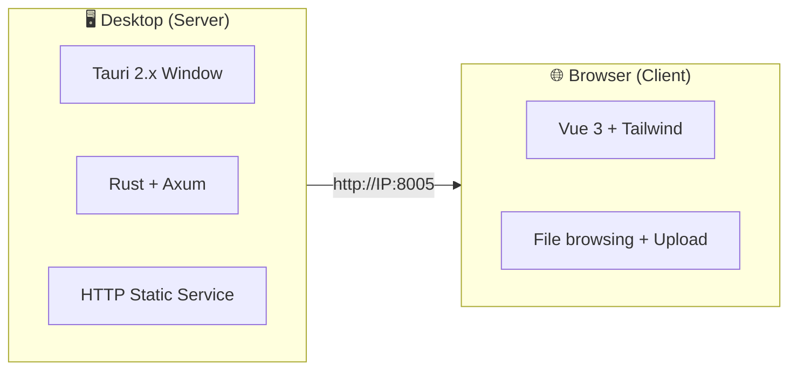
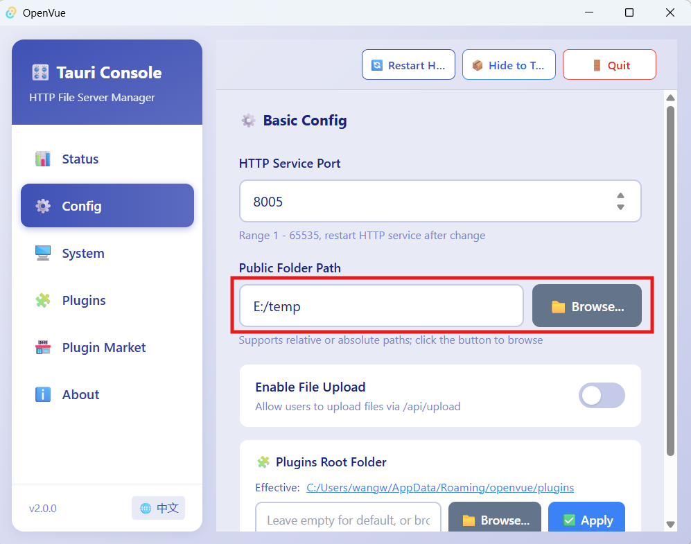
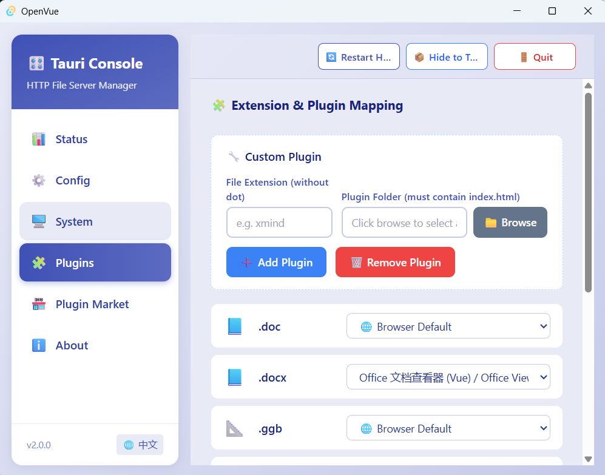
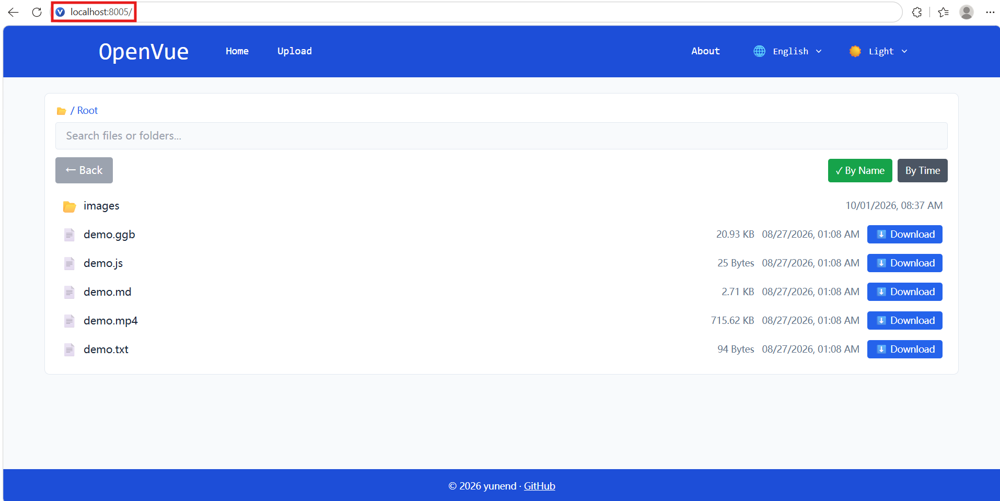
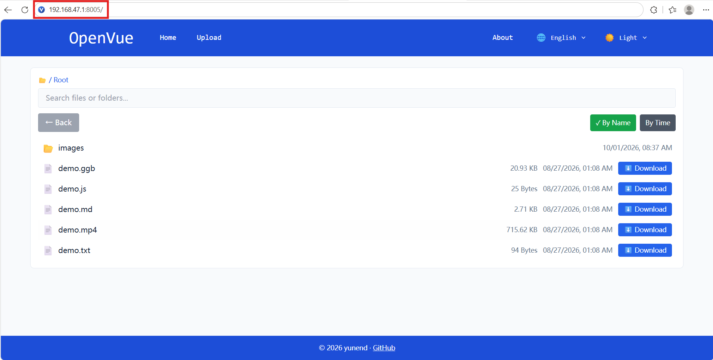
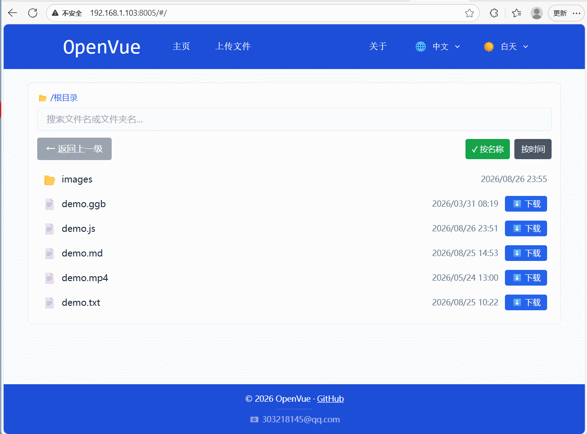
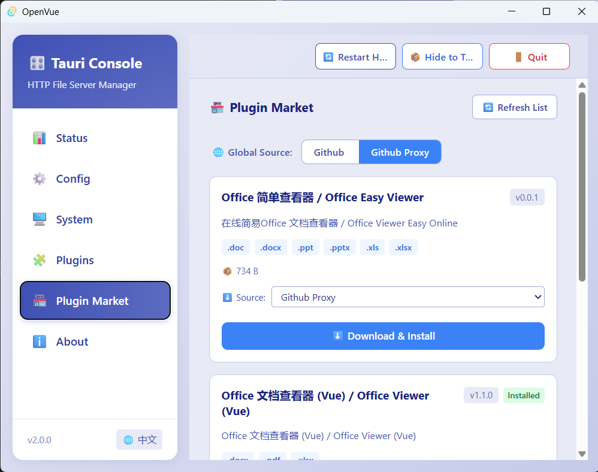

<p align="center"><a href="./README.md"></a></p>

# OpenVue

🚀 **OpenVue** is a cross-platform local file sharing and browsing tool built with **Tauri 2.x**. It combines Rust's high-performance HTTP service with Vue 3's modern frontend interface, letting you quickly share files, browse directories, and extend functionality through plugins on your local network.

---

## 💡 Why this project? (How is it different from OpenList)

The original intent of this project is to solve the problem that OpenList (and its upstream AList) is not flexible enough in "**the way files are opened**".

In short:

- **In OpenList**, the program used to open each file type is hard-coded. To support new formats (e.g., `.ggb` GeoGebra courseware), you must modify the frontend source code and recompile the entire project, which is very troublesome.
- **In OpenVue**, all of this is "**graphical and configurable**" — just a few clicks on the desktop to switch: for example, for `.md` files, you can choose between "open directly in the browser" or "open with the Markdown preview plugin", without changing code or restarting the service.

**Scenarios suitable for OpenVue**: You just want to share a folder on your computer to the local network, let your phone/tablet open specific formats (GeoGebra courseware for class, Markdown notes, etc.), and you want the opening method for these formats to be easily adjustable at any time.

---

## 📌 Version Evolution: V1 → V2

> 💡 If this is your first time using OpenVue, you can skip this section and go directly to "[Run the Project](#-run-the-project)".

OpenVue's plugin system has gone through an important architectural evolution. The following helps you quickly understand the differences between V1 and V2:

| Aspect | **V1 (Pure Built-in)** | **V2 (Built-in + Download)** |
|--------|:---:|:---:|
| **Plugin storage** | All plugins bundled into the installer (`dist-web/plugins/`) | Built-in plugins + remote download from plugin marketplace |
| **Installer size** | Large (grows linearly with plugin count) | Smaller, downloaded on demand |
| **Adding new plugins** | Modify source → recompile → reinstall | One-click download ⬇️ on the desktop app |
| **Updating plugins** | Upgrade the entire app | Update individually from the plugin marketplace |
| **Custom plugins** | Manually modify directory structure | One-click add via graphical panel |
| **Uninstalling plugins** | Delete files | One-click uninstall from the plugin marketplace |

### Plugin directory structure comparison

```
# V1 — Only one plugin directory, all built-in
dist-web/plugins/
  ├── ggb/
  └── md/

# V2 — Two plugin sources
├── dist-web/plugins/          # 📦 Built-in plugins (bundled with installer, read-only)
│   ├── ggb/
│   └── md/
│
└── ~/.config/openvue/plugins/ # 🛠️ Writable plugin directory (user custom + marketplace downloads)
    └── office-viewer/        # Downloaded from the plugin marketplace
```

### Why upgrade from V1 to V2?

1. **Smaller installer**: The more built-in plugins, the larger the installer. V2 moves low-frequency plugins out of the installer and downloads them on demand.
2. **Open ecosystem**: Third-party developers can publish plugins to the [openvue-plugins](https://github.com/yunend/openvue-plugins) repository, and users can install them directly from the marketplace.
3. **Flexible updates**: When a plugin has a new version, there is no need to upgrade the entire app — just update it individually.
4. **Customization-friendly**: Add custom plugins through the graphical panel with zero barrier.

---

## 🏗️ Project Architecture



| Layer | Tech Stack | Responsibility |
|------|--------|------|
| **Desktop (Server)** | Tauri 2.x + Rust + Axum + tower-http | Start HTTP service, tray icon, file serving, API routing |
| **Client (Web)** | Vue 3 + Vue Router + Vue i18n + Tailwind CSS | File browsing, directory navigation, file upload, plugin display |
| **Plugin System** | Driven by `plugin.json` metadata in plugin directories | Extension → opening-method mapping, supports third-party tools like GeoGebra |

---

## 🚀 Run the Project

### Method 1: Development mode (run from source)

**Environment requirements:**
- Node.js >= 18
- Rust toolchain ([rustup](https://rustup.rs/))
- Windows / macOS / Linux

```bash
# Clone the project
git clone https://github.com/yunend/openvue.git
cd openvue

# Install dependencies
npm install

# Start development mode
npm run tauri dev
```

### Method 2: Download prebuilt binaries

Download the installer for your operating system from [GitHub Releases](https://github.com/yunend/openvue/releases):

| OS | Version Requirement | File Format | Notes |
|----------|----------|----------|------|
| Windows | Windows 10+ | `.msi` / `.exe` | Double-click to install or run directly |
| macOS | macOS 10.15+ | `.dmg` | Drag into the Applications folder |
| Linux | Ubuntu 20.04+ / Debian 11+ | `.AppImage` / `.deb` | Add execute permission before running |

---

## ⚙️ Program Configuration

### Configuration file location

After extracting or installing, find `config.json` in the program directory:

```json
{
  "port": 8005,
  "publicFolder": "public",
  "enableUpload": true
}
```

| Config Option | Type | Description |
|--------|------|------|
| `port` | Number | HTTP service listening port (default 8005) |
| `publicFolder` | String | File root directory path (relative or absolute) |
| `enableUpload` | Boolean | Whether to enable the file upload feature (uploaded files are saved under `{publicFolder}/upload/`) |

### Usage steps

1. **Open the program interface to change the folder path** — In the main program window, click the "Configuration Management" button and change the file root directory (`publicFolder`) to the folder path you want to share

   

2. **Modify plugin configuration** — In the settings interface, enable or disable the plugins for each file extension (e.g., GeoGebra, MD) to control how files are opened

   

3. **Access via browser** — The browser opens automatically after startup, or manually visit `http://localhost:8005`

   

4. **Access from other devices on the local network** — Use `http://<Your-Local-IP>:8005`

   

### Plugin metadata (plugin.json)

Each plugin directory contains a `plugin.json` file describing itself. On startup, the program automatically scans the `plugins/` directory, aggregates all plugin information, and generates the runtime configuration.

```json
{
  "id": "ggb",
  "name": "GeoGebra",
  "version": "1.0.0",
  "description": "Math dynamic geometry courseware preview",
  "extensions": ["ggb"],
  "urlTemplate": "/plugins/{pluginId}/?path={publicPath}",
  "downloadSources": [
    { "label": "Github", "url": "https://github.com/.../plugin.zip", "priority": 1 },
    { "label": "Github Proxy", "url": "https://gh-proxy.com/.../plugin.zip", "priority": 2 }
  ],
  "sha256": "e261d6162b91991c..."
}
```

> 📌 Plugins downloaded from the marketplace and custom plugins will both have a `plugin.json` generated in their directory. There is no need to manually maintain the global configuration file.

---

## 🔌 Plugin Continuous Development & Integration

OpenVue supports extending file opening methods through the plugin system. Plugins are stored in the `plugins/` directory, and each plugin directory contains `plugin.json` (metadata) and `index.html` (entry page).

### GeoGebra (GGB) plugin

The integrated GeoGebra plugin supports opening `.ggb` math courseware files directly in the browser.



### Plugin development

Directory structure of each plugin:

```
plugins/
└── <plugin-name>/
    └── index.html          # Plugin entry page
    └── ...                 # Plugin resource files
```

Place `plugin.json` and `index.html` in the plugin directory, then restart the app or rescan to register it automatically.

### 🧩 Custom plugins (graphical add)

Besides manually creating `plugin.json`, you can **add custom plugins with one click** in the desktop plugin configuration panel — no code changes or restarts required:

1. **Prepare the plugin directory**: Create a subdirectory under the **user plugin directory** (default `user-config-directory/plugins/`, configurable in ⚙️ Configuration Management → Plugin Folder settings) and place plugin files in it (must include `index.html`)
2. **Open the plugin configuration panel**: Launch the OpenVue desktop app → click 🧩 Plugin Configuration in the left sidebar → go to the 🔧 Custom Plugins section
3. **Register the plugin**: Enter the file extension (e.g., `xmind`), then click 📁 Browse to select the plugin directory prepared in step 1
4. Click ➕ to add the plugin

The program automatically generates `plugin.json` in that plugin directory and sets it to the active state. The page takes effect immediately after adding, and the plugin will automatically open the corresponding files when you access them in the browser.

> 💡 Suitable scenarios: When you want to temporarily use a third-party online preview tool to open a certain file type, just put the HTML page in the plugins directory and click a couple of times in the panel.

### 🏪 Plugin marketplace (desktop)



The plugin marketplace provides **one-click download and installation** of third-party plugins. No manual configuration is needed — just operate directly in the desktop interface:

1. **Open the plugin marketplace**: Launch the OpenVue desktop app → click 🏪 Plugin Marketplace in the left sidebar
2. **Browse available plugins**: The plugin list is automatically loaded from the remote index, showing the name, description, version, extensions, etc.
3. **Choose a download source**: Each plugin may provide multiple download mirrors (e.g., `Github`, `Github Proxy`); switch freely based on your network conditions
4. **Download & install**: Click ⬇️ Download & Install, with real-time progress for the download, verification, extraction, and installation stages
5. **Update & uninstall**: Installed plugins with a new version can be updated with one click; plugins you no longer need can be uninstalled directly

> 🔗 Plugin marketplace index: `https://github.com/yunend/openvue-plugins`
> Contributions are welcome — let more people use your plugin!

### 📦 Plugin development

A plugin is essentially a **standard web page** (HTML + CSS + JS) that describes itself through `plugin.json`. OpenVue embeds the plugin page in an iframe to render files of the corresponding format.

#### Directory structure

```
plugins/
└── <plugin-id>/
    ├── plugin.json          # Plugin metadata (required)
    ├── index.html           # Plugin entry page (required)
    └── ...                  # Other resource files
```

#### plugin.json specification

```json
{
  "id": "my-plugin",
  "name": "My Plugin",
  "version": "1.0.0",
  "description": "Plugin feature description",
  "extensions": ["ext1", "ext2"],
  "urlTemplate": "/plugins/{pluginId}/?path={publicPath}",
  "downloadSources": [
    {
      "label": "Github",
      "url": "https://github.com/user/repo/releases/download/v1.0.0/plugin.zip",
      "priority": 1
    },
    {
      "label": "Github Proxy",
      "url": "https://gh-proxy.com/https://github.com/user/repo/releases/download/v1.0.0/plugin.zip",
      "priority": 2
    }
  ],
  "sha256": "e261d6162b91991c...",
  "archiveFormat": "zip",
  "sizeBytes": 1048576
}
```

| Field | Description |
|------|------|
| `id` | Unique plugin identifier; must match the directory name |
| `name` | Plugin display name |
| `version` | Version number, used to detect updates |
| `extensions` | List of supported file extensions |
| `urlTemplate` | Plugin page URL template; `{pluginId}` and `{publicPath}` are replaced automatically |
| `downloadSources` | Array of download sources (each source provides the same ZIP package with identical hashes); users can choose freely |
| `sha256` | SHA256 checksum of the ZIP package, ensuring download integrity |
| `archiveFormat` | Packaging format (currently only `zip`) |
| `sizeBytes` | Package size in bytes, used for frontend display |

#### Plugin page development notes

1. **URL parameters**: The plugin page obtains the current file's HTTP access path through the `?path=` parameter
2. **File loading**: Use the `path` parameter to build the full URL and load file content via fetch / iframe / etc.
3. **Style adaptation**: It is recommended to use a responsive layout to adapt to preview areas of different sizes
4. **No backend needed**: Plugins are purely static pages; all logic runs in the browser

> 💡 After development, package the plugin as a ZIP and submit it together with `plugin.json` to the [openvue-plugins](https://github.com/yunend/openvue-plugins) repository, and it will be displayed to all users in the plugin marketplace.

### ✅ Supported plugins

| Extension | Plugin name | Description |
|--------|--------|------|
| `ggb` | GeoGebra | Math dynamic geometry courseware preview |
| `md` | Markdown | Markdown document preview |
| `doc` `docx` `xls` `xlsx` `ppt` `pptx` | Office Viewer | Word, Excel, PowerPoint document preview (Microsoft online viewer, ⚠️ requires HTTPS public network) |

> **⚠️ Office Viewer (requires public network)**: `doc`, `docx`, `xls`, `xlsx`, `ppt`, `pptx`, etc. are rendered through Microsoft's online viewer at `https://view.officeapps.live.com`, which requires the file URL to satisfy:
> 1. **Publicly accessible**: Microsoft's servers need to fetch your file from the external network; pure local network IPs (`192.168.x.x` / `10.x.x.x`) will not work
> 2. **HTTPS protocol**: HTTPS is recommended (Microsoft may refuse to load over HTTP); use intranet tunneling or a public server for hosting

---

## 📧 Contact

- **Email**: 303218145@qq.com
- **GitHub**: [https://github.com/yunend/openvue](https://github.com/yunend/openvue)

Issues, PRs, and feedback via email are all welcome!

---

## 📄 License

This project is open-sourced under the MIT License. See the [LICENSE](LICENSE) file for details.