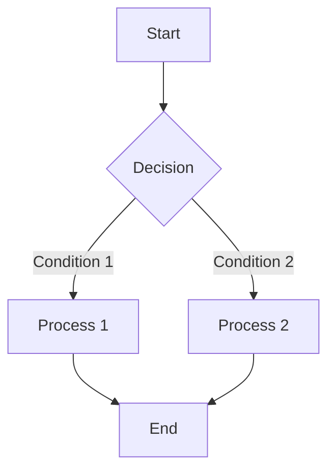

# Welcome to the Markdown Editor


This is a Markdown editor that runs **entirely in the browser locally**: edit on the left, preview in real time on the right, and drafts are automatically saved to localStorage.


## Features


- 📝 **Live Preview** — Edit on the left, instant rendering on the right

- 🌙 **Dark Mode** — Toggle theme with one click

- 💾 **Auto Save** — Content saved locally in the browser

- 🎨 **Code Highlighting** — Supports multiple programming languages

- 📊 **Mermaid Diagrams** — Flowcharts, sequence diagrams, etc.

- 🧮 **Math Formulas** — Supports KaTeX rendering

- 📋 **Table of Contents** — Insert TOC with [TOC]


## Table of Contents


[TOC]


## Syntax Examples


### Text Styles


**Bold**, *Italic*, ~~Strikethrough~~, ==Highlight==, `inline code`


### Headings


Use different numbers of `#` to create different heading levels, as follows:


```

# Heading Level 1


## Heading Level 2


### Heading Level 3

```


### Links


For more on this topic, you may refer to a previously published article: [Are You a Survivor of the Future World?](https:mp.weixin.qq.comss5IhxV2ooX3JN_X416nidA)


### Images


To insert an image, use the following format:


### Unordered Lists


To use unordered lists, add a space after the `-` symbol. As follows:


- Item 1

- Item 2

- Item 3


To control list nesting, use spaces before the `-` symbol. As follows:


- Item 1

- Item 2

&nbsp; - Item 2.1

&nbsp; - Item 2.2


### Ordered Lists


To use ordered lists, add a space after the number and `.`, then enter content. As follows:


1. Item 1

2. Item 2

3. Item 3


### Code Blocks


```javascript

function hello() {

&nbsp; console.log('Hello, Markdown!');

}

```


### Task Lists


- [x] Completed item

- [ ] Todo item

- [ ] Another task


### Tables


| Feature | Status | Description |

|---------|--------|-------------|

| Live Preview | ✅ | Edit left, render right |

| Auto Save | ✅ | localStorage storage |

| Export | ✅ | Markdown & HTML supported |


### Blockquotes


> "Markdown is a lightweight markup language that lets you focus on writing itself."


### Footnotes


Here is a footnote reference[^1].


[^1]: This is the footnote content.


### Math Formulas

Inline formula: $E = mc^2$


Block formula:


$$

  \int_{a}^{b} f(x) \, dx = F(b) - F(a)

$$

### Mermaid 图表




**Start your writing journey!** ✨